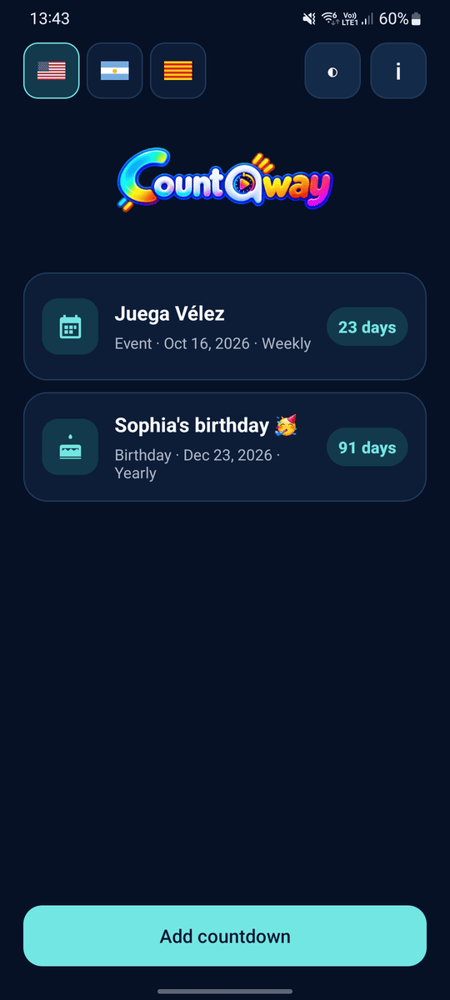
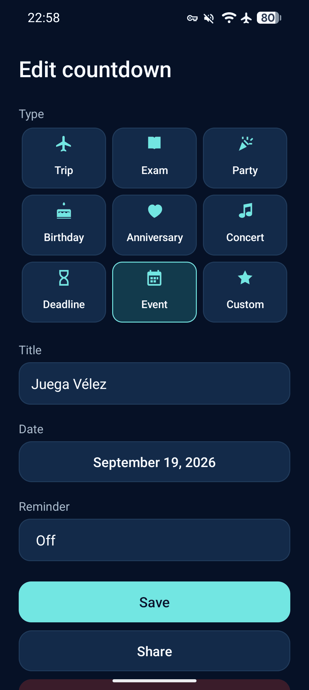
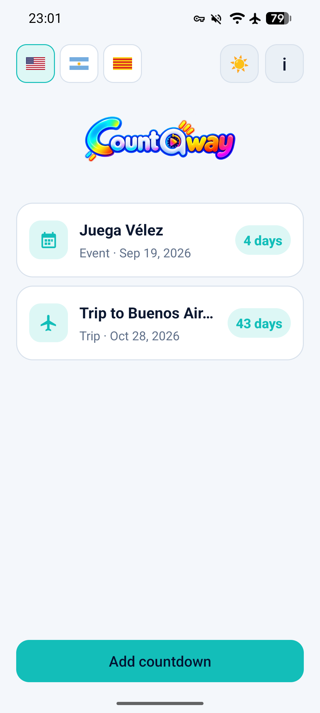
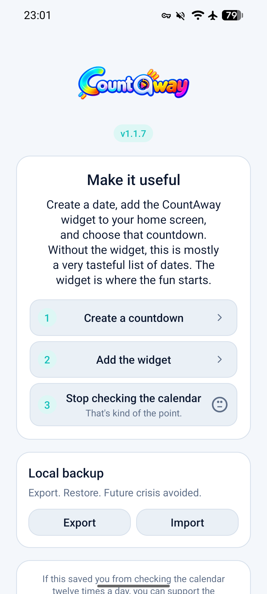

# CountAway

<p align="center">
  
</p>

<p align="center">
  <strong>A lightweight Android countdown for the things worth waiting for.</strong>
</p>

CountAway keeps countdowns local, simple, and visible where they are actually useful: on your home screen.

## Why

I wanted a home-screen widget that simply showed how many days were left until something important.

Somehow, “count the days” often turns into an account, a subscription, a dashboard, and a minor career change.

CountAway skips all that. Pick a date, put it on your home screen, and get on with your life.

## Installation

[](https://f-droid.org/packages/com.santiagorodriguez.countaway/)

[](https://apps.obtainium.imranr.dev/redirect?r=obtainium://add/https://github.com/santirodriguez/CountAway)

Or download the signed APK directly from [GitHub Releases](https://github.com/santirodriguez/CountAway/releases).

## What it does

- Multiple local countdowns with custom icons and optional yearly recurrence
- Responsive home-screen widgets, from compact 1×1 to wide layouts
- Fixed-event widgets or an automatic **Next countdown** mode
- Optional local reminders before or on the event day
- System, Light, and Dark appearance for both the app and widgets
- Native sharing plus local JSON backup and restore
- Long-press widget setup with a visual style picker and live preview on supported launchers
- Reliable fixed-countdown pinning with remembered last-used style for the next new widget
- Lightweight style-specific widget artwork rendered natively
- English, Spanish, and Catalan

Everything stays local, with no accounts, ads, analytics, or cloud sync.

## Screenshots

<p align="center">
  
  
</p>

<p align="center">
  
  
</p>

## Author

[Santiago Rodriguez](https://santiagorodriguez.com)

<a href="https://santiagorodriguez.com/donate"></a>

## Privacy

CountAway has no Internet permission, accounts, ads, analytics, or cloud sync.

Your countdowns stay on your device. Revolutionary stuff, apparently.

## Build

Requires JDK 17 and Android SDK 36.

```bash
./gradlew test lint assembleDebug assembleDebugAndroidTest assembleRelease
```

Maintainer signing and release steps are documented in [`docs/RELEASING.md`](docs/RELEASING.md). F-Droid preparation and submission notes are in [`docs/FDROID.md`](docs/FDROID.md).

## License

Licensed under the Apache License 2.0. See [LICENSE](LICENSE).
