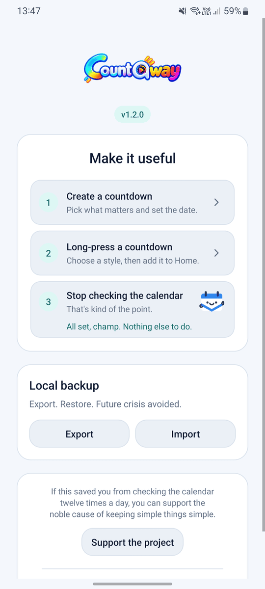
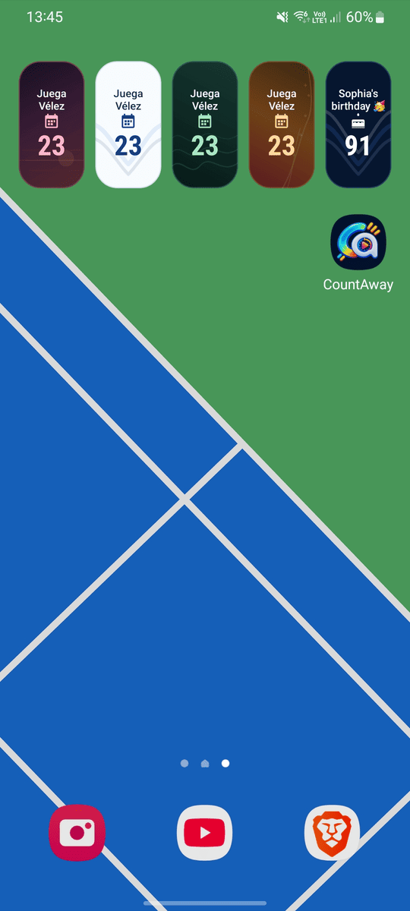

# CountAway

<p align="center">
  
</p>

<p align="center">
  <strong>A lightweight Android countdown for the things worth waiting for.</strong>
</p>

<p align="center">
  Pick a date. Put it on your home screen. Get on with your life.
</p>

<p align="center">
  <a href="https://f-droid.org/packages/com.santiagorodriguez.countaway/"></a>
  &nbsp;&nbsp;
  <a href="https://apps.obtainium.imranr.dev/redirect?r=obtainium://add/https://github.com/santirodriguez/CountAway"></a>
</p>

<p align="center">
  <a href="https://github.com/santirodriguez/CountAway/releases"></a>
  <a href="LICENSE"></a>
</p>

<p align="center">
  <sub>No accounts · no ads · no analytics · no cloud sync · no Internet permission</sub>
</p>

---

## The idea

I wanted a home-screen widget that simply showed how many days were left until something important.

Somehow, “count the days” often turns into an account, a subscription, a dashboard, and a minor career change.

CountAway skips all that. It counts the days and leaves you alone.

<table>
  <tr>
    <td width="33%" valign="top">
      <strong>Count what matters</strong><br /><br />
      Multiple countdowns, custom icons, reminders, and optional weekly, monthly, or yearly recurrence.
    </td>
    <td width="33%" valign="top">
      <strong>Keep it on Home</strong><br /><br />
      Responsive widgets from compact 1×1 to wide layouts, fixed events or an automatic <strong>Next countdown</strong>.
    </td>
    <td width="33%" valign="top">
      <strong>Keep it yours</strong><br /><br />
      Everything stays local. Backup and restore with JSON when <em>you</em> want portability. No dashboard required.
    </td>
  </tr>
</table>

## Highlights

- **Widget-first:** long-press a countdown, choose a style, preview it, and add it directly on supported launchers.
- **Flexible recurrence:** weekly, monthly, or yearly countdowns with sensible short-month handling.
- **Nine widget backgrounds:** from clean Classic to Mist, Horizon, Sunset, Ember, Ridge, and more.
- **Three appearance modes:** System, Light, and Dark for both the app and widgets.
- **Useful reminders:** optional local notifications before or on the event day.
- **Smart widget behavior:** fixed-event widgets stay fixed; **Next countdown** follows the nearest event automatically.
- **Share without the screenshot ritual:** Share turns a countdown into a Ridge-style PNG card that follows your current Light/Dark appearance.
- **Local portability:** JSON export/import stays entirely under your control.
- **Multilingual:** English, Spanish, and Catalan.

## Screenshots

<p align="center">
  
  
</p>

<p align="center">
  
  
</p>

<p align="center">
  
  
</p>

## Privacy, by design

CountAway has no Internet permission, accounts, ads, analytics, or cloud sync.

Your countdowns stay on your device. Revolutionary stuff, apparently.

## Build

Requires **JDK 17** and **Android SDK 36**.

```bash
./gradlew test lint assembleDebug assembleDebugAndroidTest assembleRelease
```

Maintainer signing and release steps are documented in [`docs/RELEASING.md`](docs/RELEASING.md). F-Droid preparation and update notes are in [`docs/FDROID.md`](docs/FDROID.md).

## Author

Created by [Santiago Rodriguez](https://santiagorodriguez.com).

<a href="https://santiagorodriguez.com/donate"></a>

## License

Licensed under the [Apache License 2.0](LICENSE).
