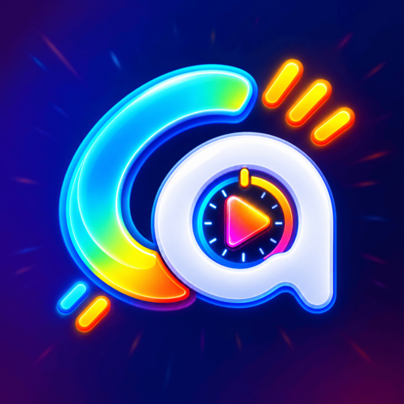
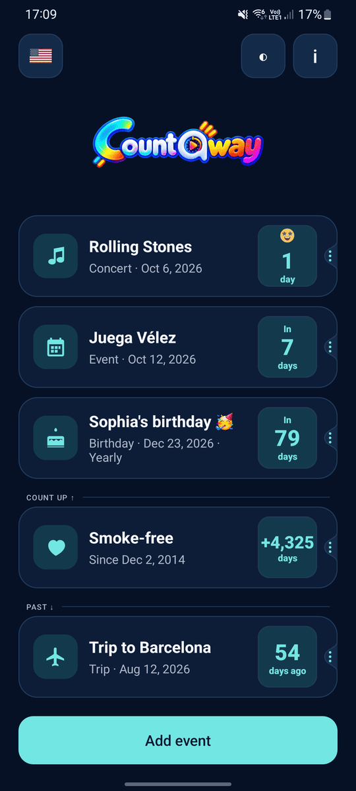
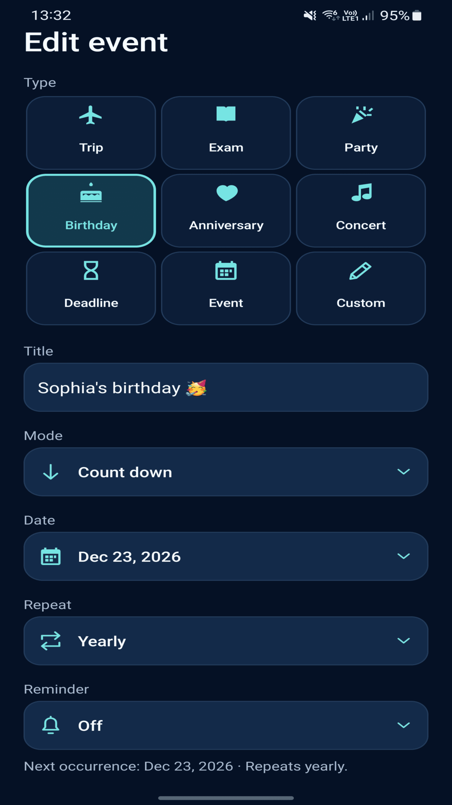
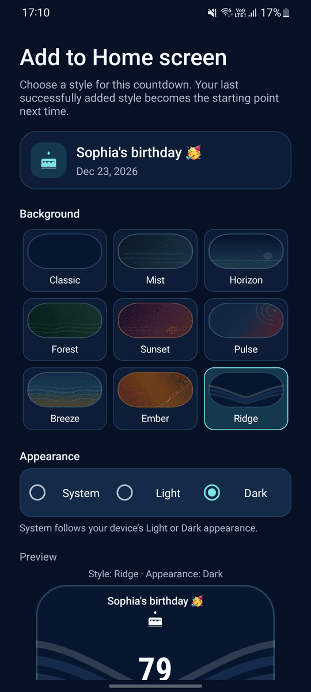
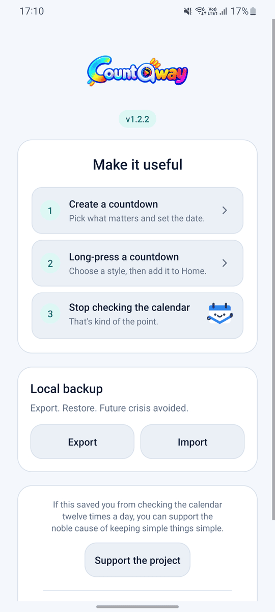
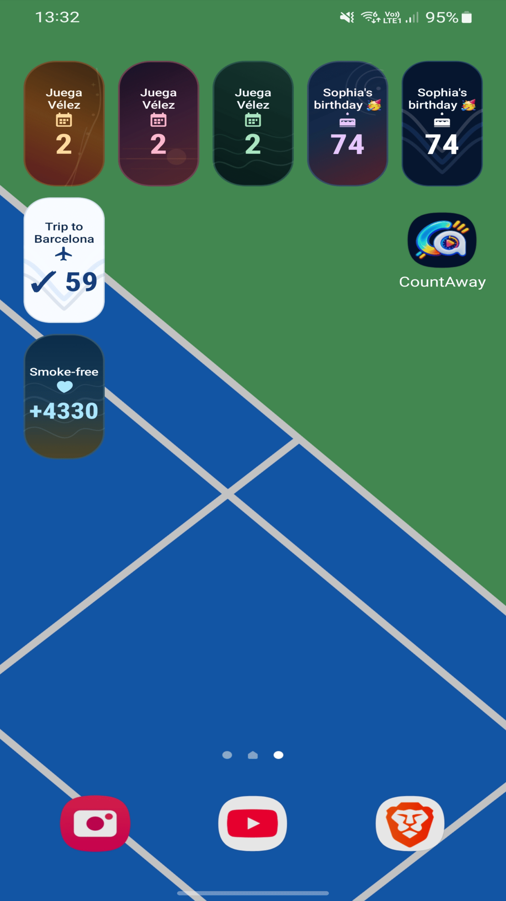

# CountAway

<p align="center">
  
</p>

<p align="center">
  <strong>A lightweight Android day counter for dates worth looking forward to — or remembering.</strong>
</p>

<p align="center">
  Pick a date. Put it on your home screen. Get on with your life.
</p>

<p align="center">
  <a href="https://f-droid.org/packages/com.santiagorodriguez.countaway/"></a>
  &nbsp;&nbsp;
  <a href="https://apps.obtainium.imranr.dev/redirect?r=obtainium://add/https://github.com/santirodriguez/CountAway"></a>
</p>

<p align="center">
  <a href="https://github.com/santirodriguez/CountAway/releases"></a>
  <a href="LICENSE"></a>
</p>

<p align="center">
  <sub>No accounts · no ads · no analytics · no cloud sync · no Internet permission</sub>
</p>

---

## The idea

I wanted a home-screen widget that simply showed how many days were left until something important.

Somehow, “count the days” often turns into an account, a subscription, a dashboard, and a minor career change.

CountAway skips all that. It counts the days and leaves you alone.

<table>
  <tr>
    <td width="33%" valign="top">
      <strong>Count what matters</strong><br /><br />
      Count down to future dates or count up from a starting date, with custom icons.
    </td>
    <td width="33%" valign="top">
      <strong>Keep it on Home</strong><br /><br />
      Responsive widgets from compact 1×1 to wide layouts, fixed events or an automatic <strong>Next countdown</strong>.
    </td>
    <td width="33%" valign="top">
      <strong>Keep it yours</strong><br /><br />
      Everything stays local. Backup and restore with JSON when <em>you</em> want portability. No dashboard required.
    </td>
  </tr>
</table>

## Highlights

- **Count both ways:** count down to future dates or count up from a start date.
- **Widget-first:** long-press an event, choose a style, preview it, and add it to Home.
- **Flexible recurrence:** weekly, monthly, or yearly count-down events.
- **Nine widget backgrounds:** from clean Classic to Mist, Horizon, Sunset, Ember, Ridge, and more.
- **Three appearance modes:** System, Light, and Dark for both the app and widgets.
- **Useful reminders:** optional local notifications for count-down events.
- **Smart widgets:** fixed widgets support both directions; **Next countdown** follows the nearest upcoming count-down event.
- **Share without the screenshot ritual:** Send a Ridge-style PNG card from an event's menu or editor.
- **Local portability:** JSON export/import stays entirely under your control.
- **Multilingual:** English, Español, and Català.

## Screenshots

<p align="center">
  
  
</p>

<p align="center">
  
  
</p>

<p align="center">
  
  
</p>

## Privacy, by design

CountAway has no Internet permission, accounts, ads, analytics, or cloud sync.

Your events stay on your device. Revolutionary stuff, apparently.

## Help improve CountAway

Found a confusing translation, a bug, or an idea worth sharing? See [how to contribute](CONTRIBUTING.md). You don't need Android experience to help with translations and feedback.

## Build

Requires **JDK 17** and **Android SDK 36**.

```bash
./gradlew test lint assembleDebug assembleDebugAndroidTest assembleRelease
```

Maintainer signing and release steps are in [`docs/RELEASING.md`](docs/RELEASING.md), with Google Play preparation in [`docs/PLAY.md`](docs/PLAY.md) and F-Droid notes in [`docs/FDROID.md`](docs/FDROID.md).

## Author

Created by [Santiago Rodriguez](https://santiagorodriguez.com).

<a href="https://santiagorodriguez.com/donate"></a>

## License

Licensed under the [Apache License 2.0](LICENSE).
